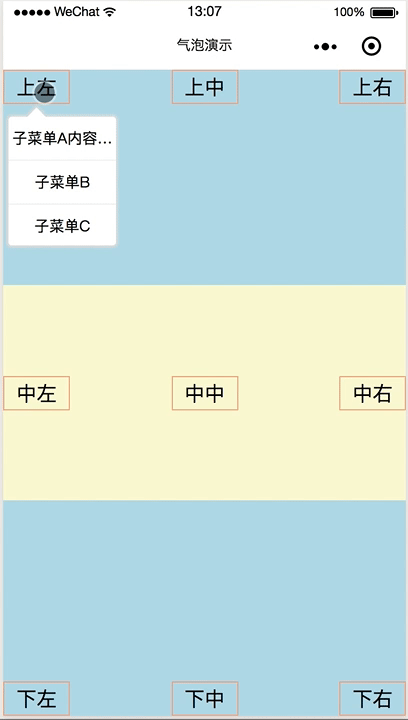

# 微信小程序自定义气泡组件

由于手机屏幕就那么点大，如果一堆按钮全部并排显示显示或挤在一起会显得比较的臃肿，为解决这个问题。所以编写了这个气泡组件。

- 能根据元素内容的宽高自动计算气泡的定位

- 气泡的内容项可以灵活的添加

## 预览




## 如何使用

- 使用 git命令 `git clone https://github.com/byk04712/weapp-swiper3D.git` 或直接下载到本地。

- 复制根目录下 `components` 文件夹内的 `popover` 和 `popover-item` 到你自己的小程序代码里

- 在需要使用的小程序页面对应的 json 文件里添加如下节点信息，主意路径填写你对应的目录
  ```
    "usingComponents": {
      "popover": "/components/popover",
      "popover-item": "/components/popover-item"
    }
  ```
 
- 在页面 `.wxml` 中可以类似使用 view 标签一样直接使用 popover，示例如下
  ```
    <view class='container'>

      <view id='button' bindtap='onTap'>Click Me</view>

      <popover id='popover'>
        <popover-item bindtap='onClickA' hasline>内容超出会自动隐藏用...表示</popover-item>
        <popover-item hasline>子菜单B</popover-item>
        <popover-item>子菜单C</popover-item>
      </popover>
    </view>
  ```
  需要用到的自定义节点上和按钮节点上最好提供 id 元素，方便代码中获取到元素节点的坐标信息。

- js文件中编写响应事件，并获取元素节点

  ```
    Page({

      onReady: function() {
        // 生命周期函数 onReady 中获取自定义的 popover 组件，根据id获取
        this.popover = this.selectComponent('#popover');
      },

      onTap: function (e) {
        // 获取按钮元素的坐标信息
        var id = '#button' // 或者 e.target.id 获取点击元素的 ID 值
        wx.createSelectorQuery().select('#' + id).boundingClientRect(res => {
          // 调用自定义组件 popover 中的 onDisplay 方法
          this.popover.onDisplay(res);
        }).exec();
      },

      // 响应popover组件中的子元素点击事件
      onClickA: function (e) {
        wx.showToast({
          title: '你点击了A',
          icon: 'none'
        });
        // 调用自定义组件 popover 中的 onHide 方法
        this.popover.onHide();
      }

    })
  ```